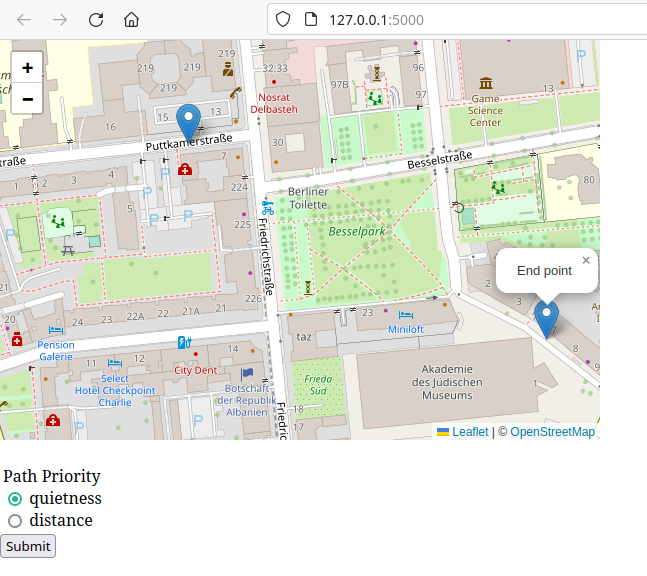
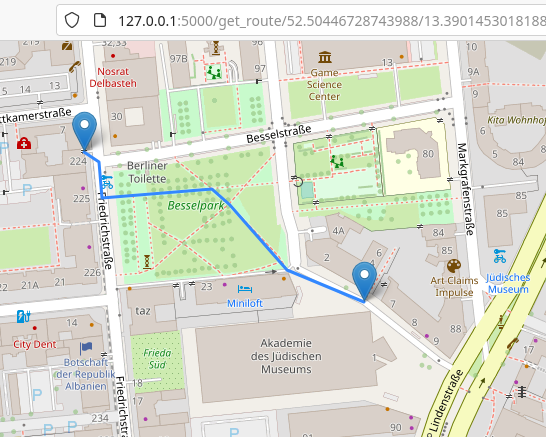

# path-finder

## Tools
- Ophois: https://github.com/ethicnology/ophois
- Dijkstra library: https://pypi.org/project/dijkstra/
- Overpass API

## How to install
TBD
- Setup a Flask server
- Download Ophois and create a symbolic link

## Usage
1. Open the site in a browser. 
2. Scroll the Map to the position you want to get your way.
3. Click two points on the map, where you want to have your start and end point.
You can also drag the start and end points to another position.
4. On _Path Priority_, select if you want the quietest path or the shortest one.
5. Click on _Submit_ to view the result.



## Run tests
Single test: pytest test/test_display_map.py::test_create_graph_one_edge

All tests: pytest test/

## Ophois usage example
Execute following commands in the command shell:

```shell
CITY=Taurinya

ophois download --city $CITY

cat $CITY.osm | ophois format | ophois extract > $CITY-extracted.graph

cat $CITY-extracted.graph | ophois simplify --delta 10.0 > $CITY-simplified.graph
```
