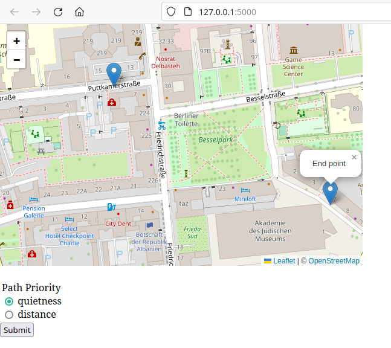
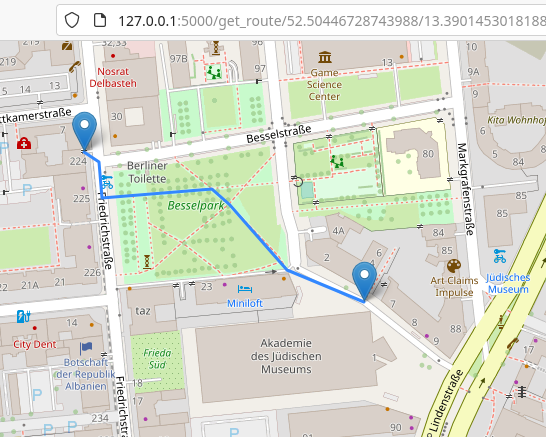

# path-finder

## Used Tools

The most important tools and libraries used are:

- [Flask](https://flask.palletsprojects.com/en/3.0.x/)
- [Dijkstra library](https://pypi.org/project/dijkstra/)
- Overpass API

## How to install

TBD

- Setup a Flask server

## Run server

```shell
flask --app src/route_api run
```

## Run tests

Single test:

```shell
pytest test/test_display_map.py::test_create_graph_one_edge
```

All tests:

```shell
pytest test/
```

## Usage

1. Open the site in a browser.
2. Scroll the Map to the position you want to get your way.
3. Click two points on the map, where you want to have your start and end point. You can also drag the start and end
   points to another position.
4. On _Path Priority_, select if you want the quietest path or the shortest one.
5. Click on _Submit_ to view the result.
   
   

## Acknowledgements

Thank you to the project [Ophois](https://github.com/ethicnology/ophois). Part of my code has been translated and
adapted from it.

Also thank you so much to Bob from [PyBites](https://pybit.es/) for the excellent coaching, thus helping me make this
project possible.